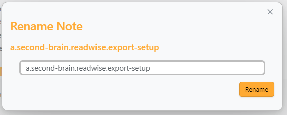

# Structured Tree

**More documentation can be found on the [Wiki](https://rudtrack.notion.site/Structured-Plugin-0ba0ee706bc84998909049f4a9c510c2).**

Structured Tree adds a tree for exploring and managing hierarchical notes similar to [Dendron](https://www.dendron.so/).

Features:

- Browse notes using a hierarchical naming scheme.
- Lookup functionality.
- Automatic frontmatter generation for new files with user-customizable options.
- Multi-vault support.
- Custom resolver and renderer for links and embeds.
- Built-in renaming modal.
- Support for all file types supported by Obsidian.

## File Support

Structured Tree supports all file types that Obsidian supports, not limited to just `.md` files. This allows you to organize and manage a wide range of content within your vault.

Note: Canvas file support is experimental. You can enable Canvas support in the plugin settings, but please be aware that bugs may occur.

## Structured Tree

To view the Structured Tree, select "Open Structured Tree" in the Application's Ribbon bar.

A note with an orange circle indicator is a note that does not have a corresponding file.

To open a note file, select the note name in the tree. This also expands the note in the tree.

To expand and collapse a note, select the arrow () on the left of the note.

Right-click a note on Desktop or long-press on Mobile to open the note's menu, which includes:

- "Create Current Note": Creates a file for the selected note (only shown when the note doesn't have a corresponding file).
- "Create New Note": Opens Lookup with the selected note's path as the initial prompt.
- "Delete Note": Deletes the selected note file (only shown when the note has a corresponding file).
- "Rename Note": Opens the renaming modal for the selected note.

## Lookup

To lookup a note, run the "Structured Tree: Lookup note" command. This allows you to open or create new notes.

Create a note by inputting a path that doesn't exist. You'll see a "Create New" item. Select this to create a new note.

You can also select a note without a corresponding file. An item that creates a new note is indicated by a `+` icon on the right.

> It's recommended to always input the path in the lookup modal.

## Multi Vault

Add or remove vaults in Plugin Settings by specifying the vault path and name.

Multi-vault has some limitations with cross vault backlinks. The custom resolver doesn't look into other vaults for backlinks.

This means that if you have a note in Vault A that links to a note in Vault B, the custom resolver will not be able to find the file and will rather create a new file in Vault A instead of opening the file in Vault B.

This is a known issue and will be fixed in a future update.

## Custom Resolver and Renderer (Disabled by Default)

This feature forces all wikilinks and embeds to render using a format similar to Dendron. It also overrides link hover functionality.

## Renaming Modal

Structured Tree includes a built-in renaming modal for efficient note management. Renaming can be done by either using the command "Structured Tree: Rename note" or by right-clicking a note and selecting "Rename Note" from the context menu.

## Auto-generate Properties

The auto-generate properties feature provides users with options and flexibility when creating new notes. It can auto-generate a unique ID, title field, description field, a "created" field for when the file was created and a tag field.

You can also change the keys being used for title and description if you prefer to use other words.

## Report Bugs And Suggestions

If you find a bug or have a suggestion for new features/improvements, please open an [issue on GitHub](https://github.com/Rudtrack/structured-tree/issues) on GitHub.

# Attribution

This plugin is based on the work of [levirs565](https://github.com/levirs565/) and their plugin [Obsidian Dendron Tree](https://github.com/levirs565/obsidian-dendron-tree). I also want to thank [Dobrovolsky Bohdan](https://github.com/dobrovolsky) for his amazing work on [Structured](https://github.com/dobrovolsky/obsidian-structure), which this plugin gets some inspiration from.

The original plugin became inactive, so it was forked to continue development as it's used daily and continual improvement was desired.

While this plugin maintains some compatibility with Dendron-structured notes, future compatibility is not guaranteed. It is primarily intended for use with notes made in Obsidian, utilizing a Dendron-like structure.
